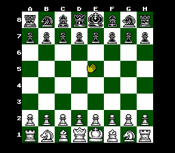

# Chessmaster960

Ever wanted to play [Chess960](https://en.wikipedia.org/wiki/Chess960) on the NES without the trouble of having to manually roll dice and input the initial positions each time? Well, now you can, with this BizHawk Lua script and your own copy of The Chessmaster ROM![^1]

[^1]: Specifically, the USA Rev 1 ROM, checksum `e9421c01`, although it may work on other ROM versions!
